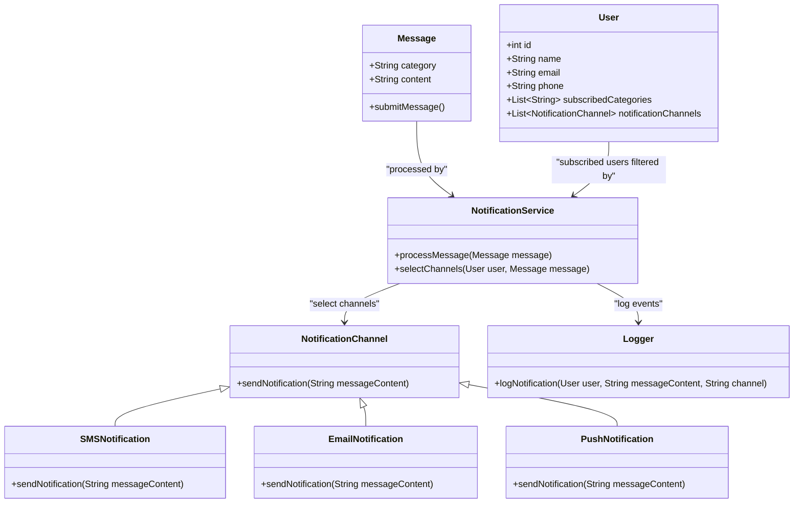

```mermaid
classDiagram
    class Message {
        +String category
        +String content
        +submitMessage()
    }

    class User {
        +int id
        +String name
        +String email
        +String phone
        +List~String~ subscribedCategories
        +List~NotificationChannel~ notificationChannels
    }

    class NotificationChannel {
        +sendNotification(String messageContent)
    }

    class SMSNotification {
        +sendNotification(String messageContent)
    }

    class EmailNotification {
        +sendNotification(String messageContent)
    }

    class PushNotification {
        +sendNotification(String messageContent)
    }

    class NotificationService {
        +processMessage(Message message)
        +selectChannels(User user, Message message)
    }

    class Logger {
        +logNotification(User user, String messageContent, String channel)
    }

    NotificationChannel <|-- SMSNotification
    NotificationChannel <|-- EmailNotification
    NotificationChannel <|-- PushNotification

    Message --> NotificationService : "processed by"
    User --> NotificationService : "subscribed users filtered by"
    NotificationService --> NotificationChannel : "select channels"
    NotificationService --> Logger : "log events"
```
