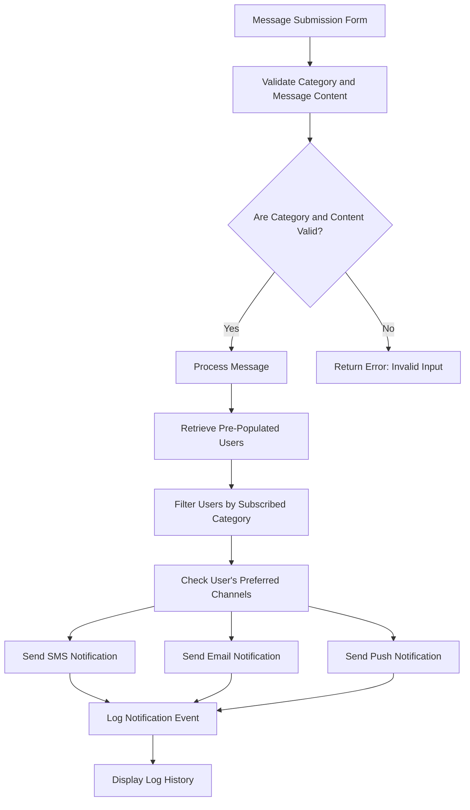

```mermaid
flowchart TD
    A[Message Submission Form] --> B[Validate Category and Message Content]
    B --> C{Are Category and Content Valid?}
    C -- Yes --> D[Process Message]
    C -- No --> E[Return Error: Invalid Input]
    D --> F[Retrieve Pre-Populated Users]
    F --> G[Filter Users by Subscribed Category]
    G --> H[Check User's Preferred Channels]
    
    H --> I1[Send SMS Notification]
    H --> I2[Send Email Notification]
    H --> I3[Send Push Notification]

    I1 --> J[Log Notification Event]
    I2 --> J[Log Notification Event]
    I3 --> J[Log Notification Event]

    J --> K[Display Log History]
```
