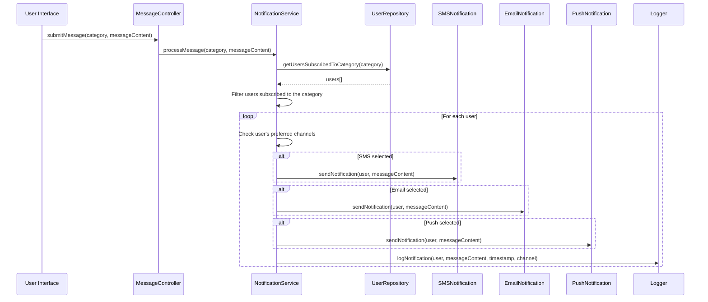

```mermaid
sequenceDiagram
    participant UI as User Interface
    participant MC as MessageController
    participant NS as NotificationService
    participant UR as UserRepository
    participant SMS as SMSNotification
    participant Email as EmailNotification
    participant Push as PushNotification
    participant Logger as Logger

    UI ->> MC: submitMessage(category, messageContent)
    MC ->> NS: processMessage(category, messageContent)
    NS ->> UR: getUsersSubscribedToCategory(category)
    UR -->> NS: users[]
    NS ->> NS: Filter users subscribed to the category
    loop For each user
        NS ->> NS: Check user's preferred channels
        alt SMS selected
            NS ->> SMS: sendNotification(user, messageContent)
        end
        alt Email selected
            NS ->> Email: sendNotification(user, messageContent)
        end
        alt Push selected
            NS ->> Push: sendNotification(user, messageContent)
        end
        NS ->> Logger: logNotification(user, messageContent, timestamp, channel)
    end
```
